# RSVP System

A modern reservation management system with a React/TypeScript frontend and ASP.NET Core backend, featuring Google Calendar and Email integration, admin dashboard, and robust API.

---

## Features
- 3-step user reservation flow
- Store and service selection
- Date/time slot selection with validation
- Reservation confirmation, edit, and cancel
- Google Calendar event creation
- Email notifications (confirmation/cancellation)
- Admin dashboard for store hours and special dates
- JWT authentication
- Swagger/OpenAPI API documentation
- SQLite database

---

## User Reservation Flow

### 1. Store Selection
Select a store to begin your reservation.


### 2. Service Selection
Choose a service offered by the selected store.


### 3. Enter Reservation Details
Fill in your information, select a date and time, and add any notes.


### 4. Reservation Confirmation
Check your reservation details after submission.


---

## Reservation Edit & Cancel
You can edit or cancel your reservation from the details page.

- **Edit Reservation:**
  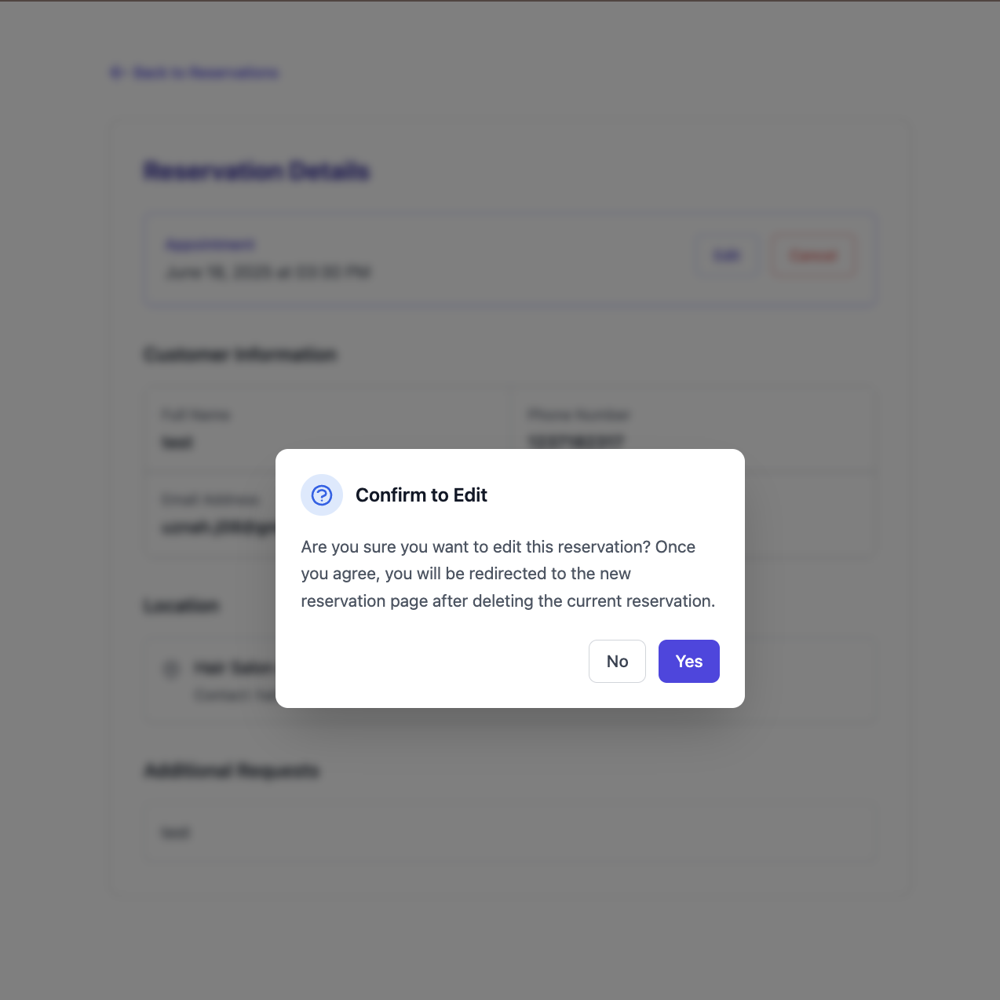
- **Cancel Reservation:**
  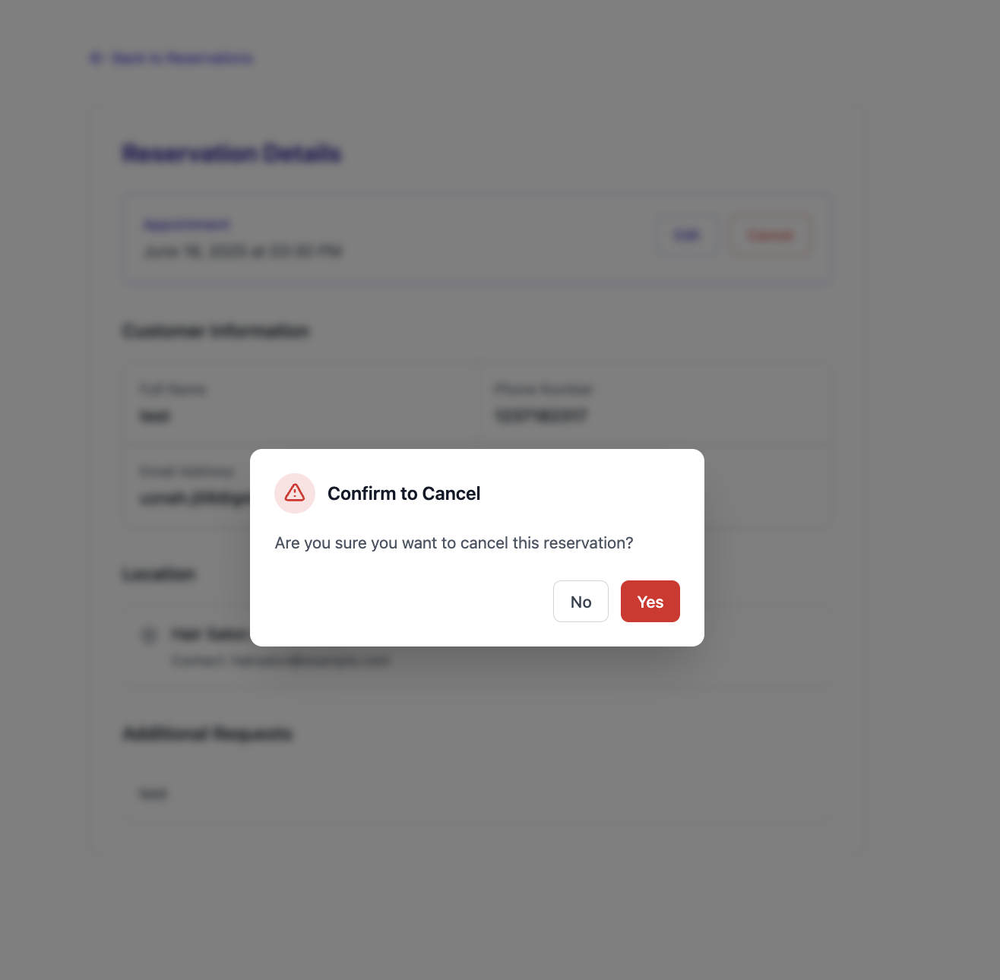
- **Cancel Success Message:**
  

---

## Email & Google Calendar Integration
- **Reservation Confirmation Email:**
  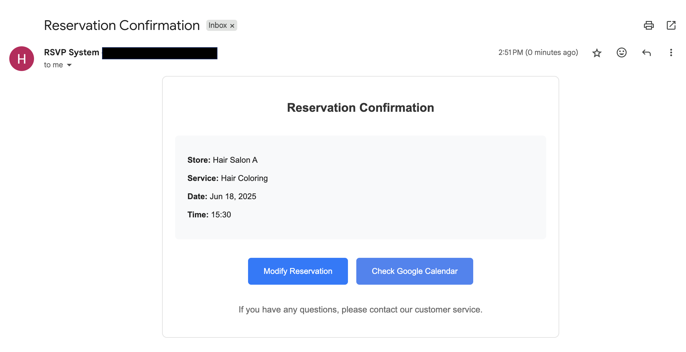
- **Google Calendar Event:**
  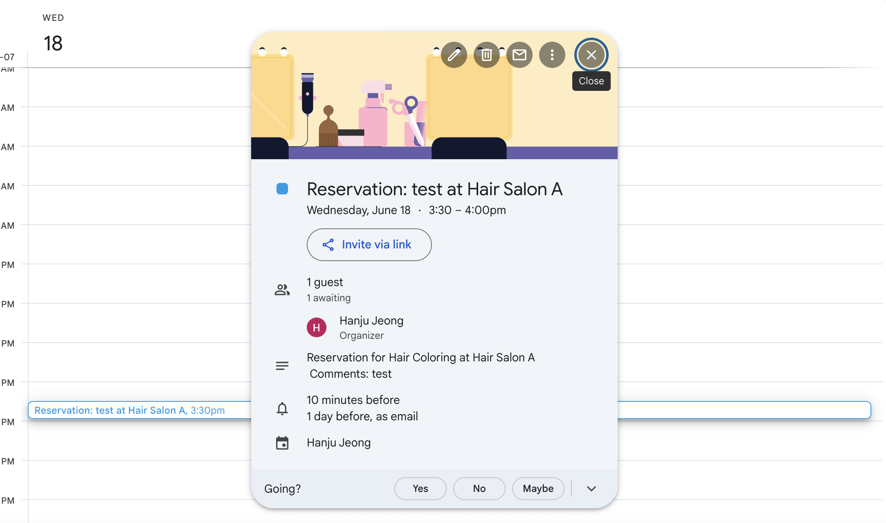
- **Reservation Cancellation Email:**
  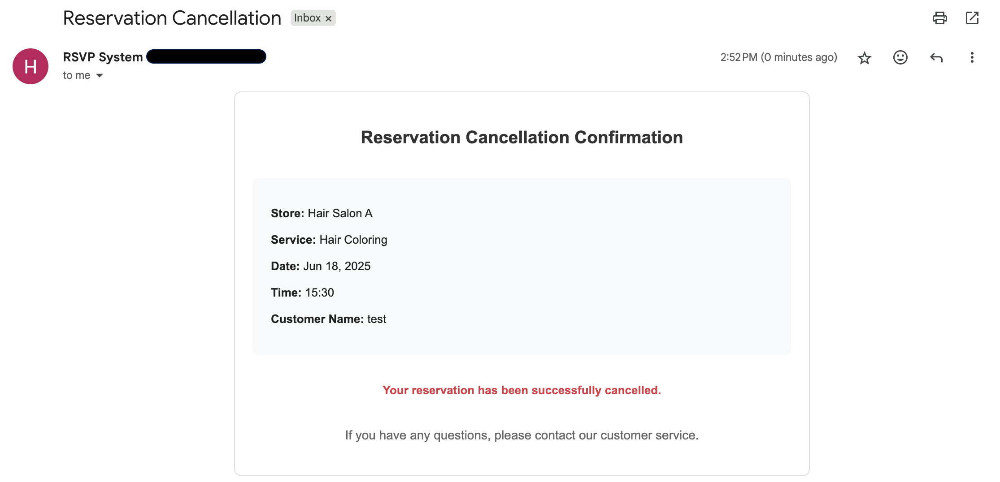

---

## Admin Dashboard

### Admin Login
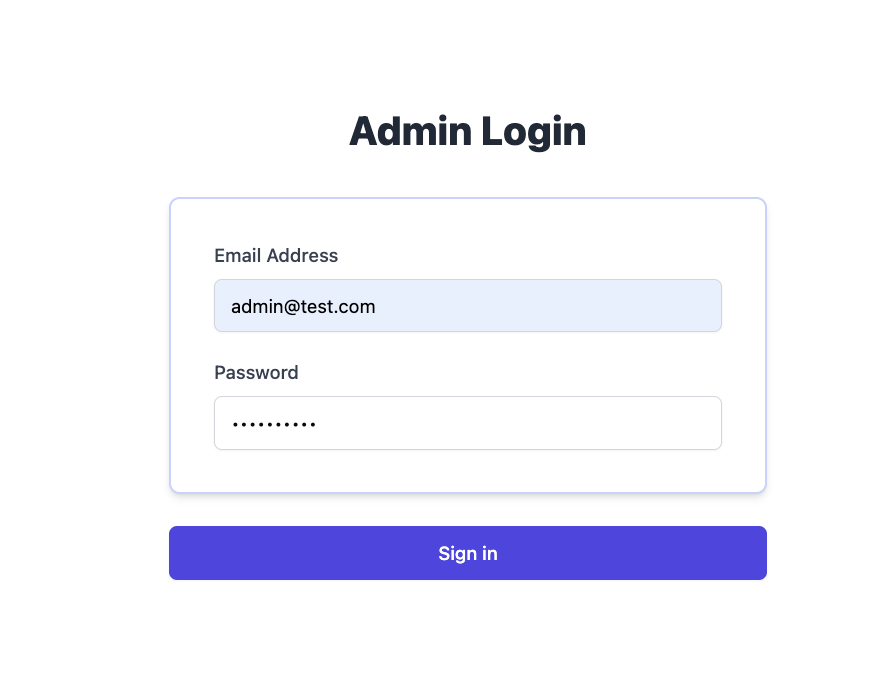

### Dashboard Main
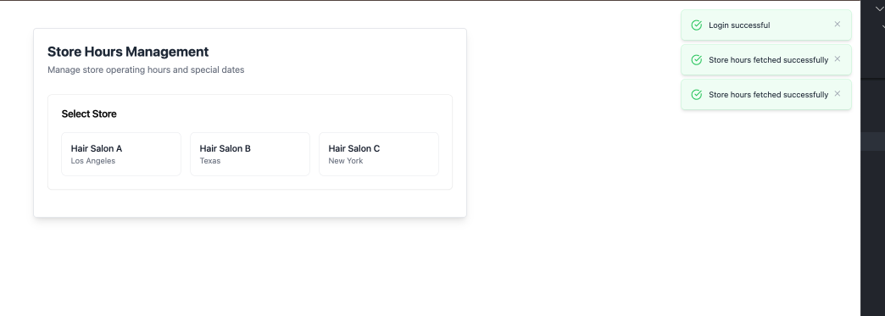

### Store Hours Management
- **Select Store:**
  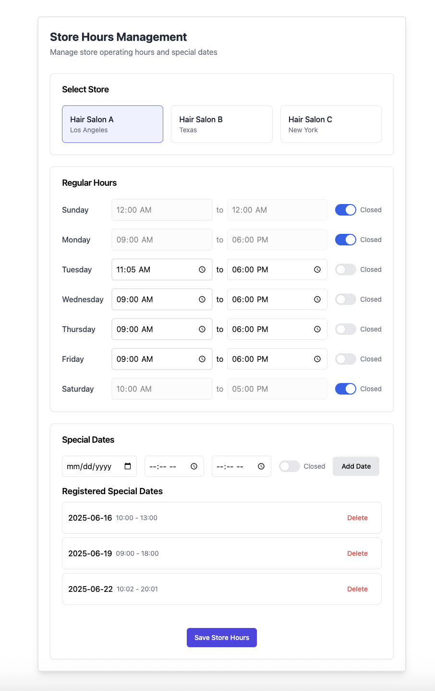
- **Special Dates Management:**
  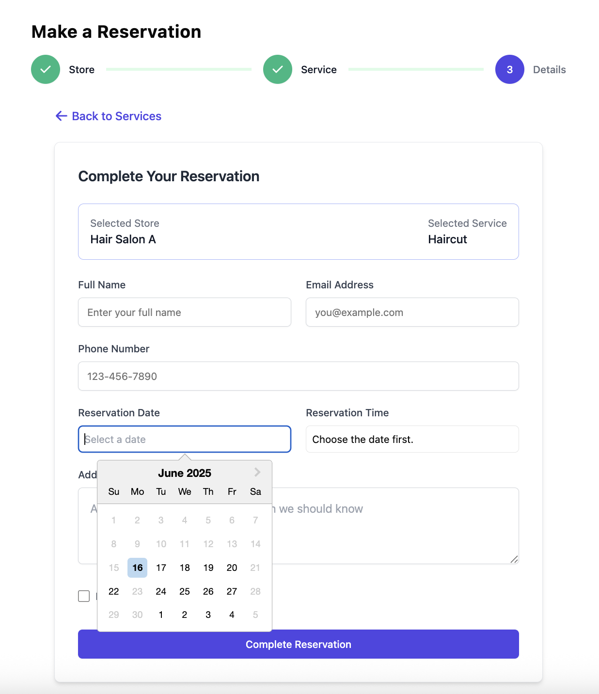
- **Regular Hours Management:**
  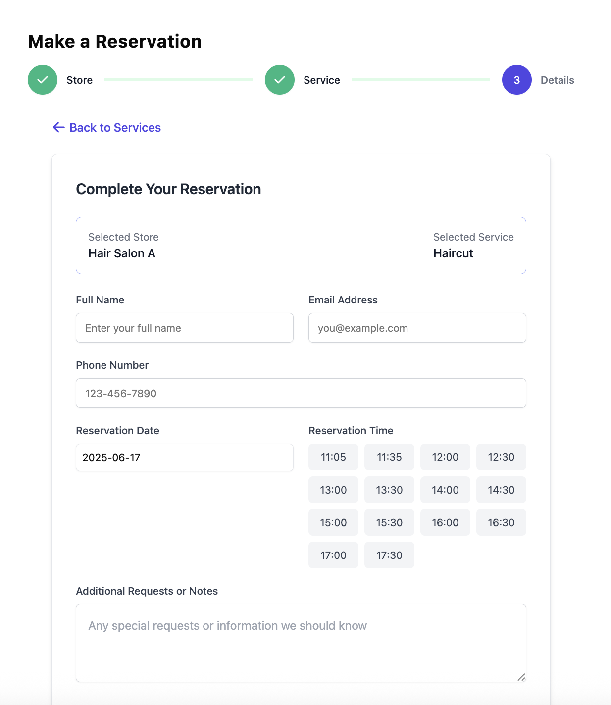

---

## Database & API Documentation
- **Database Check (SQLite):**
  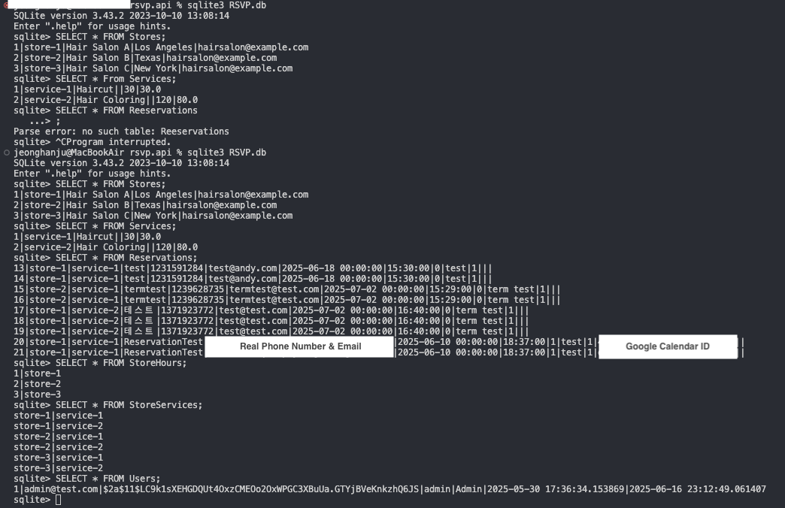
- **Swagger API Docs:**
  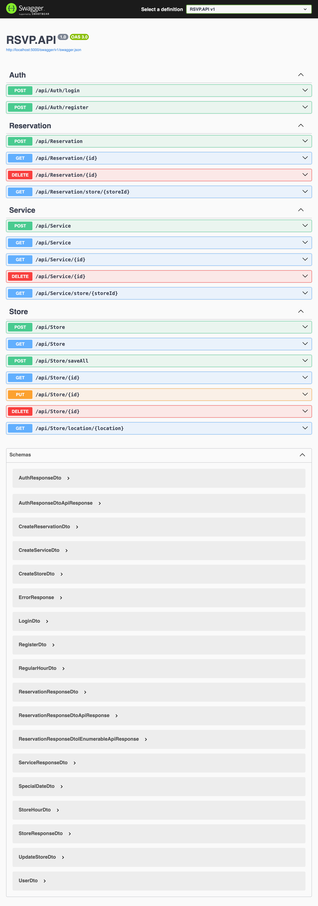

---

## Getting Started

### Prerequisites
- Node.js 16+ and npm
- .NET 8.0 SDK
- SQLite

### Installation

#### Frontend
```bash
cd client
npm install
cp .env.example .env # Edit with your API and Google credentials
npm run dev
```

#### Backend
```bash
cd server-ASP.NET
cp .env.example .env # Edit with your DB and Google credentials
dotnet restore
dotnet ef database update # Run migrations
dotnet run --project RSVP.API
```

### Environment Variables
#### Frontend (.env)
```
VITE_API_URL=http://localhost:5173/api
VITE_GOOGLE_CLIENT_ID=your_google_client_id
VITE_GOOGLE_API_KEY=your_google_api_key
```
#### Backend (.env)
```
DB_CONNECTION=Data Source=RSVP.db
JWT__Secret=your_jwt_secret
JWT__ExpiryInMinutes=60
Google__ClientId=your_google_client_id
Google__ClientSecret=your_google_client_secret
```

---

## Tech Stack & Architecture

### Frontend
- React 18, TypeScript, Redux Toolkit, React Router, Tailwind CSS, Vite
- Google Calendar & Gmail API integration

### Backend
- ASP.NET Core 8, Entity Framework Core, SQLite
- Clean Architecture (API/Core/Infrastructure)
- JWT Authentication, Google API Client, Swagger/OpenAPI

### Project Structure
```
client/
  src/components/
  src/pages/
  src/services/
  ...
server-ASP.NET/
  RSVP.API/
  RSVP.Core/
  RSVP.Infrastructure/
  ...
```

---

## Contributing
1. Fork and clone the repository
2. Create a feature branch from `main`
3. Make your changes and commit with semantic messages
4. Push and create a pull request

---

## License
MIT
